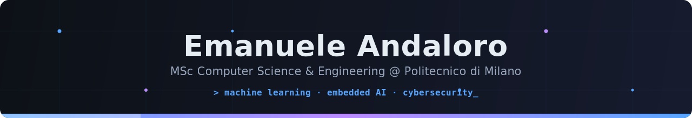

<div align="center">

<!-- ════════════════════════════ HEADER ════════════════════════════ -->


<!-- Typing animation -->
<a href="https://github.com/EmaAnd8">
  
</a>

<br/>

<!-- Quick navigation -->
<p>
  <a href="#-about-me">About</a> ·
  <a href="#-research">Research</a> ·
  <a href="#-featured-projects">Projects</a> ·
  <a href="#-tech-stack">Tech Stack</a> ·
  <a href="#-github-analytics">Stats</a> ·
  <a href="#-lets-connect">Contact</a>
</p>


</div>

<br/>

## 👨‍💻 About Me

```python
class Emanuele:

    def __init__(self):
        self.education = {
            "MSc": "Computer Science & Engineering @ Politecnico di Milano",
            "BSc": "Computer Engineering @ Università di Catania",
        }
        self.research  = ["Unsupervised Anomaly Detection", "TinyML & Embedded AI", "Wearable Systems"]
        self.interests = ["Cybersecurity", "Robotics", "Blockchain", "AI"]
        self.languages = ["Italian 🇮🇹", "English 🇬🇧"]

    def motto(self):
        return "If it only works on slides, it doesn't work."
```

- 🔭 Currently working on my **MSc thesis**: unsupervised ML for **fraud detection** on real public-transport ticketing data
- ⚡ Deploying neural networks where they *shouldn't* fit: **microcontrollers, wearables, edge devices**
- 🌱 Aiming for ...**
- 💬 Ask me about anomaly detection, model quantization, or why LaTeX + TikZ is worth the pain

<br/>

## 🔬 Research

I like machine learning that has to survive contact with the real world — messy data, tiny devices, actual users.

- 🎓 **MSc Thesis (in progress)** — Unsupervised ML pipeline for fraud detection on public-transport ticketing data (Isolation Forest, LOF, One-Class SVM), built and evaluated on real operator data
- ⚙️ **Embedded AI (ongoing)** — Real-time gesture recognition with quantized GRU models running fully on-device via ONNX

<br/>

## 🚀 Featured Projects

| Project | What it does | Built with |
|---|---|---|
| 🕵️ **VALIDATO** | Unsupervised fraud-detection pipeline for transit ticketing
| 📱 **Gesture Recognition App** | Real-time gesture recognition on mobile with a quantized GRU model running fully on-device | Flutter · ONNX Runtime |
| 🔧 **Open Source — [RLC](https://github.com/rl-language/rlc)** | LSP and fuzzing contributions to the RLC language toolchain → [my fork](https://github.com/EmaAnd8/rlc) | C++ · MLIR · libFuzzer |

<sub>🔒 Thesis and app code are private while the research is in progress — happy to walk through them, just reach out.</sub>

<br/>

## 🧰 Tech Stack

<div align="center">

**Languages**


**AI & Data Science**


**Embedded & Hardware**


**Cloud & Databases**


**Web & Mobile**


**Tools & DevOps**


</div>

<br/>

## 📊 GitHub Analytics

<!-- The metrics image below is generated INSIDE this repo by .github/workflows/metrics.yml — no external service can break it.
     It appears after you add the METRICS_TOKEN secret and run the "Generate metrics" workflow once (see the comments in metrics.yml). -->

<div align="center">



<br/><br/>


</div>

<br/>

## 🐍 Contribution Snake

<!-- This section only works after .github/workflows/snake.yml exists on the main branch AND has run at least once (Actions tab → "Generate contribution snake" → Run workflow). -->

<div align="center">
<picture>
  <source media="(prefers-color-scheme: dark)" srcset="https://raw.githubusercontent.com/EmaAnd8/EmaAnd8/output/github-contribution-grid-snake-dark.svg">
  <source media="(prefers-color-scheme: light)" srcset="https://raw.githubusercontent.com/EmaAnd8/EmaAnd8/output/github-contribution-grid-snake.svg">
  
</picture>
</div>

<br/>

## 🤝 Let's Connect

<div align="center">

<a href="https://linkedin.com/in/emanuele-andaloro/">
  
</a>
<a href="https://github.com/EmaAnd8">
  
</a>
<!-- Uncomment and add your real address when ready:
<a href="mailto:Yemanu24.anda@gmail.com">
  
</a>
-->

<br/><br/>

<!-- ════════════════════════════ FOOTER ════════════════════════════ -->


</div>
